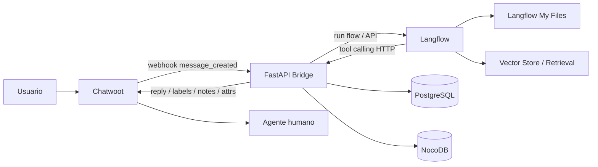

# MIWAYKI.COM – Fase 2 Local v2 (Motor Comercial Operativo Simplificado)

**Nombre del proyecto:** Plataforma de captación, cualificación y gestión de leads con chat web + IA + handoff humano  
**Estado del documento:** Documento maestro de arquitectura y desarrollo (Fase 2 local simplificada)  
**Versión:** 2.1  
**Fecha:** 2026-04-16  
**Propietario:** miwayki.com  
**Uso previsto:** Reemplazar `fase2local.md` como nueva fuente de verdad de Fase 2, conservando todas las reglas de negocio aprobadas y simplificando la solución técnica alrededor de Chatwoot + FastAPI Bridge + Langflow + NocoDB.

---

## 0. Propósito del documento

Este documento redefine la **Fase 2 local** del proyecto MiWayki.com a partir de dos hechos ya aprobados:

1. **Dify salió completamente del proyecto** y fue reemplazado por **Langflow**.
2. La arquitectura debe simplificarse para reducir conectores, dependencias y puntos de fallo, **sin cambiar el negocio**.

El objetivo de esta versión es conservar intactas las reglas comerciales ya definidas en la Fase 2 original y en su historial operativo, pero reemplazar la solución anterior por una arquitectura más simple, mantenible y gobernable.

### Regla central de esta v2

**El negocio no cambia. Cambia la solución.**

Por lo tanto, este documento:

- **preserva** estados, handoffs, pricing, flujo de pago, voucher, catálogo editable, exclusiones, colaboración humano-IA y criterios de control ya aprobados;
- **elimina** complejidad heredada de la etapa Dify que ya no aporta valor;
- **reubica responsabilidades** para que cada capa tenga un dueño claro.

---

## 1. Principios rectores congelados

Las siguientes decisiones quedan congeladas para Fase 2 v2:

1. **Chatwoot sigue siendo el canal** de entrada, el inbox humano y el lugar de handoff.
2. **FastAPI Bridge sigue existiendo**, pero como una capa mínima y estratégica, no como un backend inflado por conectores innecesarios.
3. **Langflow es el único orquestador IA** del proyecto.
4. **NocoDB sigue siendo la fuente de verdad estructurada** del catálogo comercial editable.
5. **PostgreSQL sigue siendo la fuente de verdad operativa** para memoria estructurada, estados, cotizaciones, reservas y sesiones.
6. **Los itinerarios descriptivos y literatura comercial no vivirán solo en NocoDB**: se gestionarán como documentos Markdown y se ingerirán en Langflow para retrieval semántico.
7. **El pricing nunca se calculará con RAG ni con prompts**. El pricing lo resuelve exclusivamente el Bridge a partir de reglas explícitas.
8. **El pago sigue siendo manual por transferencia** en esta fase.
9. **El voucher siempre obliga a revisión humana**. Esa regla no se negocia.
10. **No entra Mautic en Fase 2**. Eso sigue reservado para Fase 3.
11. **No entra AWS en Fase 2**. Todo sigue local.
12. **No entra n8n ni otro orquestador extra**. El coordinador único sigue siendo el Bridge.

---

## 2. Resumen ejecutivo

La Fase 2 local v2 reduce la arquitectura al mínimo sano:

```text
Chatwoot -> FastAPI Bridge -> Langflow
                |
                +-> PostgreSQL (estado y memoria)
                +-> NocoDB (catálogo estructurado)
                +-> Integraciones críticas de negocio

Langflow -> My Files / vector store (itinerarios Markdown y FAQs)
```

### Qué cambia respecto a la versión anterior

- Ya no existe ninguna dependencia funcional de Dify.
- Se elimina la complejidad heredada de una arquitectura pensada para envolver a Dify.
- Langflow asume el rol de **motor conversacional principal**, incluyendo:
  - intake,
  - extracción de datos,
  - objeciones,
  - recuperación documental,
  - y tool calling al Bridge.
- El Bridge se conserva porque sigue siendo el lugar correcto para:
  - webhook controlado de Chatwoot,
  - lógica de negocio,
  - pricing,
  - máquina de estados,
  - persistencia,
  - handoff,
  - y acciones críticas.

### Qué no cambia respecto al negocio ya aprobado

- catálogo editable con NocoDB,
- pricing por reglas,
- cotización en vivo,
- estados comerciales,
- voucher y revisión humana,
- handoffs críticos,
- exclusión de Mautic/Stripe/AWS en esta fase,
- y operación local por Docker Compose.

---

## 3. Problema que resuelve esta v2

La versión anterior de Fase 2 ya había definido correctamente el negocio, pero todavía arrastraba complejidad de una arquitectura en la que la IA estaba pensada alrededor de Dify. Eso generaba dudas como:

- demasiados conectores,
- demasiados puntos de fallo,
- demasiadas capas de reenvío,
- ambigüedad sobre dónde vive cada responsabilidad,
- riesgo de mantenimiento doloroso.

Esta v2 corrige eso con un criterio simple:

### Criterio de diseño

- **Lo conversacional y semántico** vive en Langflow.
- **Lo estructurado editable del negocio** vive en NocoDB.
- **Lo transaccional, operativo y crítico** vive en FastAPI Bridge + PostgreSQL.
- **Lo humano** vive en Chatwoot.

---

## 4. Arquitectura funcional v2

## 4.1 Diagrama lógico principal



## 4.2 Bloques oficiales de la solución

### A. Chatwoot
Responsabilidades:
- canal de entrada del cliente;
- widget web y posibles canales conectados;
- historial conversacional;
- etiquetas y notas privadas;
- atributos de conversación/contacto;
- handoff humano.

### B. FastAPI Bridge
Responsabilidades:
- recibir y validar eventos desde Chatwoot;
- evitar loops;
- decidir si se responde por IA o se bloquea por estado/handoff;
- llamar a Langflow cuando corresponde;
- ejecutar lógica comercial;
- consultar NocoDB;
- persistir estado y memoria en PostgreSQL;
- publicar respuestas y metadatos en Chatwoot.

### C. Langflow
Responsabilidades:
- intake conversacional;
- clasificación de intención;
- extracción estructurada;
- diálogo guiado;
- manejo de objeciones;
- retrieval de literatura comercial e itinerarios;
- tool calling HTTP al Bridge.

### D. NocoDB
Responsabilidades:
- fuente de verdad del catálogo estructurado;
- edición operativa por supervisores/marketing sin tocar código;
- activación/desactivación de tours, temporadas y reglas.

### E. PostgreSQL
Responsabilidades:
- memoria estructurada;
- cotizaciones persistidas;
- reservas;
- estados comerciales;
- sesiones por conversación;
- trazabilidad operativa.

### F. Langflow My Files + Retrieval Layer
Responsabilidades:
- almacenar archivos Markdown de itinerarios y literatura comercial;
- alimentar el flujo documental de Langflow;
- permitir respuestas ricas, semánticas y actualizables sin tocar código;
- separar claramente descripción de tour de reglas de pricing.

---

## 5. Qué se elimina explícitamente de la arquitectura anterior

Se eliminan o dejan fuera los siguientes patrones heredados:

1. **Toda dependencia funcional de Dify.**
2. **Toda referencia a `conversation_id` de Dify** como verdad conversacional.
3. **Toda lógica diseñada solo para compensar limitaciones de Dify.**
4. **Cualquier doble capa de orquestación innecesaria** entre Chatwoot y Langflow.
5. **Cualquier conector “pegamento” que solo transforme payloads** sin aportar una responsabilidad de negocio real.
6. **RAG usado como fuente de verdad comercial para pricing o disponibilidad.**

### Importante

La simplificación **no elimina** el Bridge. El Bridge se conserva porque sigue siendo la capa correcta para todo lo crítico.

---

## 6. Qué reglas de negocio se preservan sin cambios

Las siguientes reglas aprobadas en la versión anterior siguen vigentes:

### 6.1 Pricing
- El precio se calcula en vivo.
- El cálculo depende de:
  - tarifa base,
  - variante,
  - temporada,
  - feriados,
  - reglas por grupo,
  - excepciones comerciales.
- El pricing no puede depender de prompts ni de RAG.
- La fuente estructurada del cálculo es NocoDB.
- El cálculo efectivo y final lo ejecuta el Bridge.

### 6.2 Estados comerciales
Se preservan los estados comerciales ya definidos:
- `new_inquiry`
- `quoted`
- `awaiting_payment`
- `voucher_received`
- `closed_won`
- `closed_lost`
- `handoff`

### 6.3 Coexistencia de estados
Los estados comerciales y los estados conversacionales **coexisten** como máquinas complementarias. Esta v2 no elimina esa coexistencia.

### 6.4 Voucher
- El usuario puede enviar voucher por el chat.
- El Bridge registra el evento.
- El estado cambia a `voucher_received`.
- **Siempre se activa revisión humana**.

### 6.5 Handoffs críticos
Se preservan como mínimo los siguientes handoffs:
- grupo grande;
- grupo escolar/colegio;
- ruta inexistente;
- fecha inexistente o no cotizable;
- ausencia de regla clara de pricing;
- método de pago no automatizado o no soportado;
- voucher recibido.

### 6.6 Exclusiones de Fase 2
Se preservan las exclusiones ya aprobadas:
- sin Mautic;
- sin AWS;
- sin Stripe automático;
- sin n8n;
- sin pricing por RAG.

---

## 7. Modelo de propiedad de datos

Esta sección es la más importante de toda la v2.

## 7.1 Qué vive en NocoDB

NocoDB es la **fuente de verdad estructurada** del catálogo comercial.

Debe contener:
- tours;
- variantes;
- temporadas;
- reglas de feriado;
- reglas de precio;
- cuentas bancarias;
- excepciones comerciales;
- flags de activación/desactivación;
- metadatos de contenido documental vinculado.

### Tipos de datos que sí pertenecen a NocoDB
- `tour_slug`
- nombre comercial del tour
- categoría
- estado activo/inactivo
- variante/ruta vigente
- rango de fechas de temporada
- fecha de salida o patrón de salidas
- precio base
- recargos
- descuentos
- grupo mínimo / máximo
- observación corta estructurada
- referencias a documentación activa

## 7.2 Qué vive en PostgreSQL

PostgreSQL es la **fuente de verdad operativa**.

Debe contener:
- leads;
- memoria estructurada del lead;
- estados comerciales;
- cotizaciones emitidas;
- reservas;
- sesiones de conversación;
- eventos críticos;
- historial de handoffs;
- resumen de feedback humano.

## 7.3 Qué vive en Langflow como contenido documental

Langflow no será sistema de record para pricing, pero sí será la capa correcta para contenido no estructurado.

Debe contener o consumir:
- Markdown de itinerarios;
- FAQs extensas;
- restricciones narrativas;
- recomendaciones;
- qué llevar;
- copy comercial largo;
- observaciones por clima o temporada en lenguaje natural.

### Regla importante

Los archivos Markdown de itinerario **no sustituyen** a NocoDB. Son una capa documental complementaria.

## 7.4 Qué vive en Chatwoot

Chatwoot sigue conteniendo:
- el historial conversacional bruto;
- etiquetas;
- notas privadas;
- atributos visibles al equipo;
- ownership humano de la conversación.

---

## 8. Estrategia para itinerarios que cambian cada 15 días

Este punto se redefine oficialmente en v2.

## 8.1 Problema operativo

Los tours cambian frecuentemente por:
- season;
- clima;
- lluvias;
- rutas cerradas;
- nuevas rutas;
- reemplazo de salidas;
- ajustes de descripción;
- alta rotación de productos.

Eso vuelve inviable tratar el itinerario solo como código o solo como texto fijo en el flow.

## 8.2 Solución oficial v2

Se usará un modelo dual:

### Capa A — NocoDB
Para lo estructurado y exacto.

### Capa B — Markdown + Langflow Retrieval
Para lo narrativo y descriptivo.

## 8.3 Flujo editorial semanal

Cada vez que marketing cree o actualice un tour:

1. actualiza el tour y sus campos estructurados en NocoDB;
2. genera o actualiza un archivo Markdown del itinerario;
3. sube el Markdown a Langflow My Files;
4. ejecuta o dispara el flujo de ingestión documental;
5. el flow conversacional usa ese contenido para responder.

## 8.4 Qué no hará marketing

Marketing **no debe editar**:
- el flow principal de ventas;
- componentes críticos del canvas;
- prompts base del sistema;
- tools HTTP del Bridge;
- lógica de estados;
- pricing;
- reglas de handoff.

## 8.5 Qué sí puede hacer marketing sin desarrollador

Marketing sí puede:
- editar NocoDB;
- crear y actualizar archivos `.md`;
- subir los archivos a Langflow My Files;
- activar el flujo de ingestión documental;
- revisar si el documento quedó indexado.

## 8.6 Decisión técnica oficial sobre retrieval en Langflow

Para esta v2, los documentos Markdown **no se tratarán como fuente estructurada de negocio**. Se manejarán como contenido no estructurado para retrieval semántico.

Por lo tanto:
- no se usará Langflow para calcular precios desde texto;
- no se usará el texto del itinerario como truth source de fechas y reglas;
- sí se usará para enriquecer respuestas.

---

## 9. Plantilla oficial del itinerario Markdown

Todos los itinerarios o descripciones largas deben seguir una plantilla estándar.

```md
# TOUR: {tour_name}

## Metadata
- tour_slug: {tour_slug}
- variant_slug: {variant_slug}
- season_code: {season_code}
- content_version: {YYYYMMDD-N}
- status: active|archived
- effective_from: {date}
- effective_to: {date or open}

## Resumen comercial
Descripción corta del tour.

## Perfil del viajero
Para quién es este tour.

## Incluye
- ...

## No incluye
- ...

## Itinerario
### Día / Tramo 1
...
### Día / Tramo 2
...

## Recomendaciones
- ...

## Restricciones
- ...

## FAQ
### Pregunta 1
Respuesta...

## Observaciones de temporada
...
```

### Regla operacional
Todo documento Markdown debe contener, como mínimo:
- `tour_slug`
- `variant_slug`
- `content_version`
- rango de vigencia

Esto permite vincularlo al catálogo estructurado.

---

## 10. Diseño de NocoDB v2

NocoDB sigue siendo el catálogo vivo, pero se amplía con campos documentales mínimos para convivir con Langflow.

## 10.1 Tablas mínimas obligatorias

1. `tours`
2. `tour_variants`
3. `seasons`
4. `holidays`
5. `pricing_rules`
6. `bank_accounts`
7. `commercial_exceptions`

## 10.2 Campos recomendados adicionales

### En `tours`
- `tour_slug`
- `display_name`
- `status`
- `default_variant_slug`
- `active_content_version`
- `active_doc_slug`
- `short_sales_summary`
- `sales_enabled`

### En `tour_variants`
- `variant_slug`
- `tour_slug`
- `route_name`
- `status`
- `effective_from`
- `effective_to`
- `route_notes_short`
- `content_version`
- `doc_slug`

### En `seasons`
- `season_code`
- `tour_slug`
- `variant_slug`
- `start_date`
- `end_date`
- `season_type`
- `season_surcharge`
- `narrative_notes_short`

### En `pricing_rules`
- `rule_code`
- `tour_slug`
- `variant_slug`
- `group_type`
- `min_pax`
- `max_pax`
- `flat_price`
- `delta_amount`
- `delta_percent`
- `active`

### En `commercial_exceptions`
- `exception_code`
- `tour_slug`
- `variant_slug`
- `effective_from`
- `effective_to`
- `override_type`
- `override_value`
- `requires_handoff`
- `notes`

## 10.3 Regla de gobernanza

NocoDB no debe llenarse con la descripción completa del tour. Debe contener:
- campos estructurados,
- resúmenes cortos,
- referencias al documento activo,
- y flags operativos.

---

## 11. Langflow v2: rol exacto

Langflow deja de ser solo “un reemplazo de Dify” y pasa a ser el núcleo conversacional real de la fase.

## 11.1 Capacidades que sí asumirá

- intake conversacional;
- clasificación de intención;
- extracción avanzada;
- memory conversacional de flujo;
- semantic routing;
- recuperación documental;
- tool calling HTTP al Bridge;
- manejo de objeciones;
- composición de respuesta final.

## 11.2 Capacidades que no debe asumir como fuente única

- pricing;
- truth source de catálogo;
- estados comerciales definitivos;
- confirmación final de pago;
- auditoría operativa;
- ownership final de handoff.

## 11.3 Flows oficiales recomendados en Langflow

### Flow 1 — Sales Orchestrator
Flow principal de conversación con cliente.

### Flow 2 — Itinerary Ingestion
Flow para cargar Markdown, dividir, vectorizar e indexar contenido.

### Flow 3 — Voucher Triage Helper
Flow opcional para identificar que llegó voucher y resumir contexto, pero sin cerrar automáticamente la venta.

### Flow 4 — Internal Knowledge Support
Flow opcional para preguntas internas del equipo sobre tours, políticas y FAQ.

## 11.4 Restricción operativa

El equipo no debe depender de que marketing entre al canvas principal del Flow 1. El flow principal es de desarrollo/control técnico, no editorial.

---

## 12. FastAPI Bridge v2: rol exacto

El Bridge se reduce, pero se vuelve más importante.

## 12.1 Por qué sigue existiendo

Porque sigue siendo el lugar correcto para:
- webhook controlado de Chatwoot;
- validación de firma;
- anti-loop;
- decisiones de handoff;
- pricing;
- estado comercial;
- persistencia fuerte;
- integración estructurada con NocoDB;
- escritura controlada en Chatwoot;
- ejecución de consecuencias de negocio.

## 12.2 Responsabilidades obligatorias del Bridge

### Entrada
- `POST /webhooks/chatwoot`
- validación HMAC/firma
- filtrado de mensajes entrantes válidos
- control de replay
- control de mensajes de bot/agente

### Orquestación
- decidir si la conversación puede seguir en IA;
- decidir si debe bloquearse por handoff;
- enriquecer payload para Langflow;
- recibir salida estructurada de Langflow.

### Negocio
- consultar NocoDB;
- calcular cotizaciones;
- guardar memoria estructurada;
- manejar estados comerciales;
- registrar voucher;
- disparar handoff.

### Escritura de vuelta en Chatwoot
- respuesta del bot;
- etiquetas;
- custom attributes;
- notas privadas;
- flags visibles al equipo.

## 12.3 Regla técnica congelada

**Langflow nunca escribe directamente en Chatwoot ni en NocoDB.**

Langflow habla con el Bridge. El Bridge es quien publica, persiste y decide.

---

## 13. Endpoints mínimos obligatorios del Bridge

Se preservan y normalizan estos endpoints:

### Salud
- `GET /health`
- `GET /health/langflow`
- `GET /health/nocodb`

### Canal
- `POST /webhooks/chatwoot`

### Catálogo y pricing
- `GET /catalog/tours`
- `POST /quote/calculate`

### Lead
- `POST /lead/upsert`

### Pago y reserva
- `POST /reservation/payment-instructions`
- `POST /reservation/voucher`

## 13.1 Normalización de naming

A partir de esta v2, el endpoint oficial es:

- `POST /lead/upsert`

Se abandona `/lead/update` como naming ambiguo.

---

## 14. Memoria estructurada y persistencia

PostgreSQL debe contener, como mínimo:

- `leads`
- `quotes`
- `reservations`
- `langflow_sessions`
- `handoff_events` (recomendado)
- `seller_feedback` (recomendado)

## 14.1 Campos mínimos sugeridos para `leads`

- `lead_id`
- `chatwoot_conversation_id`
- `chatwoot_contact_id`
- `name`
- `email`
- `phone`
- `destination_interest`
- `variant_interest`
- `travel_dates`
- `party_size`
- `group_type`
- `budget`
- `urgency`
- `commercial_state`
- `conversation_state`
- `latest_quote_id`
- `last_ai_summary`
- `pending_seller_feedback`
- `handoff_required`
- `created_at`
- `updated_at`

## 14.2 Sesión de conversación

La sesión técnica de Langflow debe persistirse por conversación de Chatwoot o por lead, no en memoria volátil.

---

## 15. Flujo de venta v2

## 15.1 Flujo end-to-end

```text
1. Usuario escribe en Chatwoot.
2. Chatwoot dispara webhook al Bridge.
3. Bridge valida, carga estado y decide si IA puede responder.
4. Bridge llama al Flow 1 de Langflow.
5. Langflow clasifica intención, extrae datos y, si necesita, llama tools HTTP del Bridge.
6. Bridge calcula, persiste y responde a Langflow.
7. Langflow compone la respuesta final.
8. Bridge publica la respuesta en Chatwoot.
9. Si hay aceptación de pago, Bridge cambia estado a awaiting_payment.
10. Si llega voucher, Bridge marca voucher_received y activa handoff obligatorio.
11. Humano confirma cierre y marca closed_won o closed_lost.
```

## 15.2 Flujo de cotización

1. usuario consulta;
2. Langflow identifica intención;
3. si faltan datos, pregunta;
4. cuando tiene mínimos, llama `/quote/calculate`;
5. Bridge consulta NocoDB y calcula precio;
6. responde precio, breakdown y flags;
7. Langflow comunica la cotización;
8. Bridge actualiza estado a `quoted`.

## 15.3 Flujo de pago

1. usuario acepta;
2. Langflow llama `/reservation/payment-instructions`;
3. Bridge devuelve cuentas bancarias activas y monto;
4. estado pasa a `awaiting_payment`;
5. usuario recibe instrucciones.

## 15.4 Flujo de voucher

1. usuario envía comprobante;
2. Langflow detecta intención o adjunto y llama `/reservation/voucher`;
3. Bridge registra voucher;
4. estado pasa a `voucher_received`;
5. handoff obligatorio;
6. humano valida;
7. cierre manual a `closed_won` o `closed_lost`.

---

## 16. Handoffs críticos preservados

Se preservan como mínimo los siguientes triggers de handoff:

1. `party_size` supera umbral configurado.
2. `group_type` escolar o gran grupo.
3. tour inexistente.
4. variante/ruta inexistente.
5. fecha fuera de catálogo o fuera de regla.
6. pricing no resoluble.
7. excepción comercial activa que exige revisión.
8. método de pago no soportado.
9. voucher recibido.

## 16.1 Señales visibles en Chatwoot

Cuando hay handoff, el Bridge debe:
- etiquetar la conversación;
- escribir resumen privado;
- marcar atributos relevantes;
- bloquear la continuidad automática si aplica.

---

## 17. Colaboración humano–IA

Se preserva el mismo principio de continuidad:

- la IA captura contexto y avanza;
- el humano entra solo cuando hace falta;
- no debe haber repreguntas innecesarias.

### Elementos obligatorios
- notas privadas en Chatwoot;
- etiquetas;
- atributos visibles;
- resumen AI;
- seller feedback pendiente/consumido;
- trazabilidad del estado.

---

## 18. Operación editorial de marketing

## 18.1 Responsabilidades de marketing

Marketing será dueño de:
- mantener NocoDB al día en lo estructurado;
- producir el Markdown del itinerario;
- subir el archivo a Langflow;
- ejecutar o solicitar reingesta documental;
- verificar contenido activo.

## 18.2 Responsabilidades de desarrollo

Desarrollo será dueño de:
- modelado de NocoDB;
- endpoints del Bridge;
- flows de Langflow;
- seguridad del webhook;
- tool calling;
- storage vectorial;
- control de versiones;
- despliegue local;
- debugging y observabilidad.

## 18.3 SLA operativo sugerido

Cada cambio de season debe completarse en este orden:

1. actualización NocoDB;
2. actualización Markdown;
3. reingesta en Langflow;
4. verificación manual de consulta;
5. habilitación comercial.

---

## 19. Exclusiones explícitas de Fase 2 v2

Se mantienen fuera de alcance:

- Mautic y campañas automatizadas;
- AWS o despliegue cloud formal;
- Stripe y cobro automático;
- n8n u orquestadores extra;
- event sourcing completo;
- pricing impulsado por RAG;
- edición libre del flow principal por personal no técnico.

---

## 20. Plan de implementación v2

## Fase 2.0 — Limpieza arquitectónica y freeze

Objetivo:
- congelar esta v2 como nueva fuente de verdad;
- remover referencias residuales de Dify;
- confirmar arquitectura mínima;
- validar naming definitivo.

Criterio de salida:
- documento aprobado;
- compose y variables alineadas;
- decisiones congeladas.

## Fase 2.1 — Catálogo estructurado en NocoDB

Objetivo:
- terminar tablas y campos v2;
- normalizar slugs y versiones;
- dejar NocoDB listo para operación editorial.

Criterio de salida:
- `/catalog/tours` funcional;
- tablas pobladas;
- supervisors pueden editar.

## Fase 2.2 — Bridge operativo mínimo

Objetivo:
- asegurar webhook, pricing, lead upsert, payment instructions y voucher.

Criterio de salida:
- endpoints operativos;
- persistencia PG funcional;
- estados comerciales válidos.

## Fase 2.3 — Langflow Sales Orchestrator

Objetivo:
- construir el flow principal;
- conectar intake, extraction, objection handling y tools HTTP.

Criterio de salida:
- cotización completa desde chat;
- sin pricing en prompts;
- tool calling estable.

## Fase 2.4 — Capa documental de itinerarios

Objetivo:
- definir formato Markdown oficial;
- montar flujo de ingestión;
- validar retrieval útil y preciso.

Criterio de salida:
- marketing sube docs sin tocar código;
- respuestas enriquecidas por Langflow.

## Fase 2.5 — Pago, voucher y handoff

Objetivo:
- cerrar el flujo de depósito;
- registrar voucher;
- activar revisión humana obligatoria.

Criterio de salida:
- `quoted -> awaiting_payment -> voucher_received -> closed_won/lost` probado;
- handoff visible en Chatwoot.

## Fase 2.6 — Hardening local

Objetivo:
- pruebas E2E;
- manejo de errores;
- logs estructurados;
- persistencia de sesión;
- checklist de salida.

Criterio de salida:
- suite verde;
- runbook local;
- operación repetible.

---

## 21. Criterios de aceptación v2

La Fase 2 v2 se considera aceptada solo si se cumplen todos:

1. Chatwoot funciona como canal único de entrada.
2. El Bridge valida y controla el webhook.
3. Langflow es el único orquestador IA activo.
4. NocoDB es la fuente de verdad estructurada del catálogo.
5. PostgreSQL persiste lead, quote, reservation y session.
6. Pricing solo se calcula en Bridge.
7. Voucher obliga a handoff humano.
8. Marketing puede actualizar tours sin tocar código.
9. Marketing puede subir Markdown a Langflow sin editar el flow principal.
10. Las respuestas sobre itinerarios usan retrieval documental.
11. Los cambios de season pueden reflejarse sin deploy de código.
12. Las reglas de negocio históricas permanecen vigentes.

---

## 22. Checklist de migración desde `fase2local.md`

Antes de considerar esta v2 activa, deben revisarse estos puntos:

- [ ] Reemplazar `fase2local.md` por `fase2localv2.md` como fuente de verdad.
- [ ] Eliminar en docs y runbooks cualquier instrucción residual de Dify.
- [ ] Renombrar/adaptar cualquier artefacto `dify_*` todavía existente.
- [ ] Mantener endpoints ya aprobados en el Bridge.
- [ ] Validar que `lead/update` quede formalmente deprecado a favor de `lead/upsert`.
- [ ] Conservar la coexistencia entre estados comerciales y conversacionales.
- [ ] Preservar handoff obligatorio por voucher.
- [ ] Definir operación editorial de Markdown + Langflow.
- [ ] Verificar que pricing, catálogo y retrieval estén claramente separados.

---

## 23. Decisiones finales congeladas

1. **Arquitectura oficial de Fase 2 v2:** Chatwoot + FastAPI Bridge + Langflow + NocoDB + PostgreSQL.
2. **Bridge permanece** como capa mínima estratégica.
3. **Langflow reemplaza totalmente a Dify.**
4. **NocoDB no se reemplaza.** Se refuerza su rol como catálogo estructurado.
5. **Markdown + retrieval en Langflow** se vuelve el mecanismo oficial para itinerarios y literatura comercial cambiante.
6. **Marketing opera contenido y catálogo, no flujos críticos.**
7. **El negocio aprobado se conserva íntegro.**

---

## 24. Conclusión

La Fase 2 local v2 representa una simplificación fuerte de la solución sin sacrificar control operativo.

La arquitectura correcta para esta etapa no es:
- ni un monolito total dentro de Langflow,
- ni la arquitectura más pesada heredada de Dify.

La arquitectura correcta es una solución de **tres bloques principales con dos fuentes de datos claramente separadas**:

- **Chatwoot** para canal y humano,
- **FastAPI Bridge** para control y negocio,
- **Langflow** para IA y retrieval,
- **NocoDB** para catálogo estructurado,
- **PostgreSQL** para estado y memoria.

Con esta v2:
- se reducen conectores,
- se reducen puntos de fallo,
- se mantiene flexibilidad editorial,
- y se conserva intacta la lógica de negocio ya aprobada.

---

## 25. Apéndice — Resumen ultra corto para el equipo

```text
NocoDB = verdad estructurada del negocio
PostgreSQL = verdad operativa y memoria
Langflow = conversación + retrieval + tools
Chatwoot = canal + humano
Bridge = control, pricing, estado, handoff y escritura final
```
